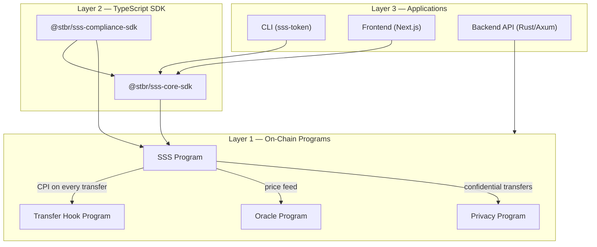
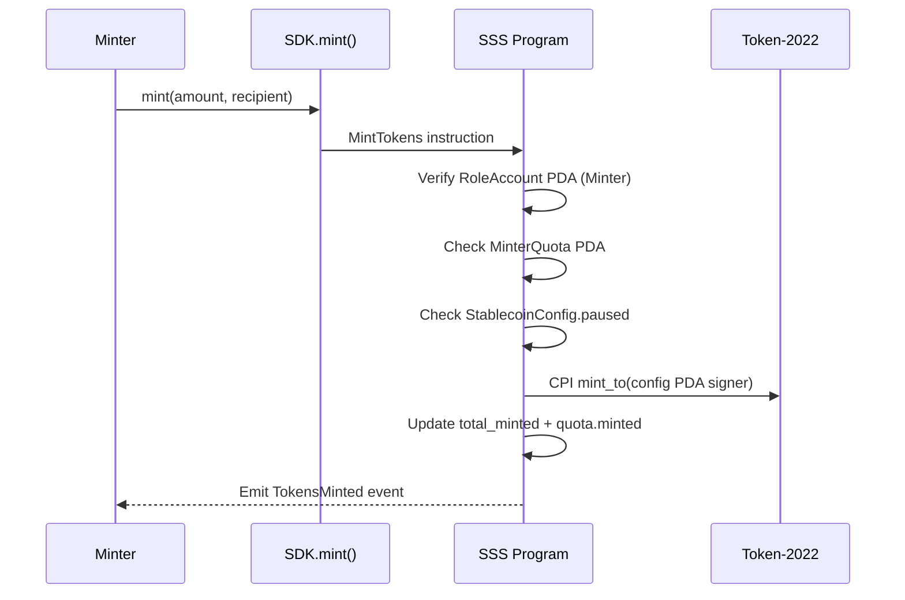
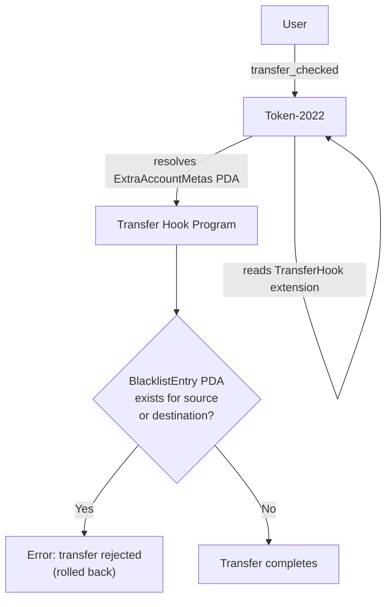

# Architecture

## Three-Layer Model

```
Layer 3: Applications (CLI, Frontend, Backend API)
Layer 2: TypeScript SDK (@stbr/sss-core-sdk, @stbr/sss-compliance-sdk)
Layer 1: On-chain Programs (sss, transfer-hook, oracle, privacy)
```



### Layer 1 — On-Chain Programs

Four Anchor programs deployed on Solana:

**SSS Program** — Core stablecoin logic. Creates a Token-2022 mint with optional extensions (MetadataPointer, PermanentDelegate, TransferHook, ConfidentialTransfer), manages roles, quotas, and compliance operations. The config PDA owns the mint authority, freeze authority, and permanent delegate.

**Transfer Hook Program** — Implements the SPL Transfer Hook Interface. On every `transfer_checked`, Token-2022 CPIs into this program which checks BlacklistEntry PDAs for the source and destination owners. If either is blacklisted, the transfer is rejected. (SSS-2 only)

**Oracle Program** — Companion data provider for non-USD pegs. Reads Switchboard V2 price feed aggregators, validates staleness and price bounds, and stores the verified price in an `OracleConfig` PDA. Permissionless cranking via `refresh_price`.

**Privacy Program** — Companion program for SSS-3 confidential transfers. Manages an on-chain `PrivacyConfig` and `AllowlistEntry` PDAs for scoped access control to ConfidentialTransfer operations.

### Layer 2 — TypeScript SDK

**@stbr/sss-core-sdk** — `SolanaStablecoin` class with static factories (`create`, `load`), instruction builders for all 13 operations, fluent builder API, batch operations, event parsing, retry logic with exponential backoff, transaction simulation, PDA derivation helpers, and preset configurations (`SSS_1`, `SSS_2`, `SSS_3`). Also includes `OracleModule` and `PrivacyModule`.

**@stbr/sss-compliance-sdk** — `ComplianceModule` with blacklist management, `BlacklistManager` for querying blacklist state, and `AuditLog` for transaction history analysis.

### Layer 3 — Applications

**CLI** (`sss-token`) — Commander.js CLI with 12 subcommands wrapping the SDK for terminal-based administration. Features spinners, color output, and Solana Explorer links.

**Backend** (Rust/Axum) — REST API for programmatic access with API key auth, synchronous on-chain execution, operation tracking, event indexing, and webhook notifications with HMAC signing and retry.

**Frontend** (Next.js) — Admin panel for stablecoin management using Solana Wallet Adapter and the TypeScript SDK.

**Admin TUI** — Terminal dashboard (ratatui) with real-time supply, roles, minters, and blacklist monitoring.

## PDA Layout

| Account | Seeds | Program | Preset |
|---------|-------|---------|--------|
| StablecoinConfig | `["stablecoin", mint]` | SSS | All |
| RoleAccount | `["role", config, role_type_u8, user]` | SSS | All |
| MinterQuota | `["minter_quota", config, minter]` | SSS | All |
| BlacklistEntry | `["blacklist", config, address]` | SSS | SSS-2 |
| ExtraAccountMetas | `["extra-account-metas", mint]` | Transfer Hook | SSS-2 |
| OracleConfig | `["oracle_config", stablecoin_config]` | Oracle | Optional |
| PrivacyConfig | `["privacy_config", stablecoin_config]` | Privacy | SSS-3 |
| AllowlistEntry | `["allowlist", privacy_config, address]` | Privacy | SSS-3 |

## Data Flow

### Mint Flow
```
Minter → SDK.mint() → SSS Program
  1. Verify Minter role (RoleAccount PDA)
  2. Check quota (MinterQuota PDA)
  3. Check not paused (StablecoinConfig)
  4. CPI: mint_to (Token-2022)
  5. Update total_minted, minter.minted
  6. Emit TokensMinted event
```



### Transfer with Blacklist (SSS-2)
```
User → transfer_checked (Token-2022)
  1. Token-2022 reads TransferHook extension from mint
  2. Resolves ExtraAccountMetas PDA
  3. CPIs to Transfer Hook program
  4. Hook checks BlacklistEntry PDAs for source & dest owners
  5. If blacklisted → error, transfer rolled back
  6. If not → transfer completes
```



### Seize Flow
```
Seizer → SDK.seize() → SSS Program
  1. Verify Seizer role
  2. Verify permanent delegate enabled
  3. CPI: transfer_checked as permanent delegate
  4. Emit TokensSeized event
```

## Security Model

**Role-Based Access Control** — Five role types, each stored as a separate PDA. Master authority assigns/revokes roles. No arrays — scales to unlimited role holders.

**Feature Gating** — SSS-2 instructions check `config.enable_transfer_hook` / `config.enable_permanent_delegate` and fail gracefully on SSS-1 configs.

**Checked Arithmetic** — All u64 operations use `checked_add`/`checked_sub` to prevent overflow.

**PDA Authority** — The config PDA is the mint authority, freeze authority, and permanent delegate. All token operations go through the program via CPI with PDA signer seeds.

**Bump Storage** — PDA bumps are stored in account state, never recalculated.

## Token-2022 Extensions

| Extension | Purpose | When Enabled |
|-----------|---------|--------------|
| MetadataPointer | Points mint metadata to the mint itself | Always (all presets) |
| TokenMetadata | On-chain name, symbol, URI storage | Always (all presets) |
| PermanentDelegate | Config PDA can transfer tokens without owner signature | SSS-2 (`enable_permanent_delegate = true`) |
| TransferHook | Hooks into every `transfer_checked` for blacklist enforcement | SSS-2 (`enable_transfer_hook = true`) |
| ConfidentialTransferMint | Enables El Gamal encrypted balance transfers | SSS-3 (`enable_confidential_transfer = true`) |

## Program IDs (Localnet)

| Program | ID |
|---------|-----|
| SSS | `DNfk1e2vMJrxHm4BwoRTVqQxcfYjZLHggxr11hMZ5Dyu` |
| Transfer Hook | `Gcd58Ng9gqRg1XtiU1i8KopwX1u82Mt9VmxKbLJ8RANH` |
| Oracle | `6PHWYPgkVWE7f5Saak4EXVh49rv9ZcXdz7HMfHnQdNLJ` |
| Privacy | `Bmyova5VaKqiBRRDV4ft8pLsdfgMMZojafLy4sdFDWQk` |
